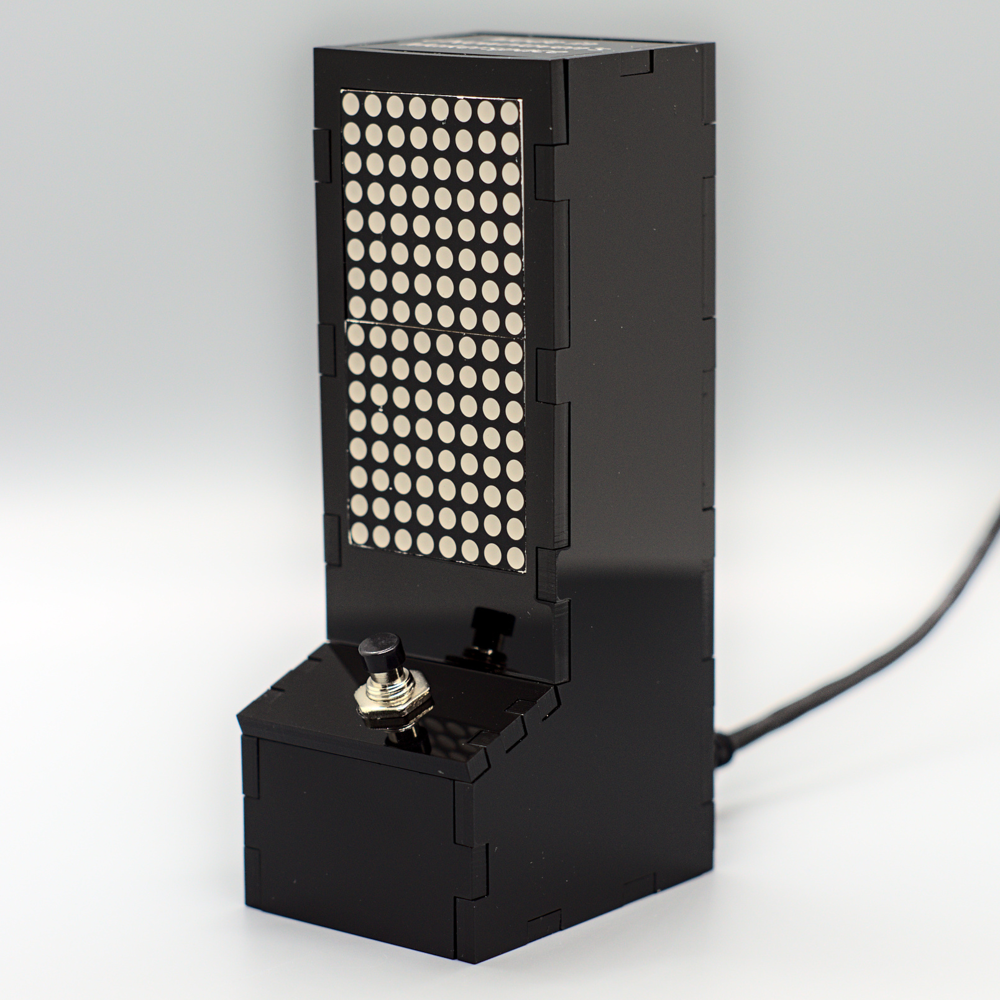

# Arcade Style LED Matrix Enclosure

This enclosure is for an LED matrix (16x2), 2 buttons, and some microcontroller (Arduino Nano for example) designed in the shape of an arcade game.

As of right now a Rev1.0 is released, but there is no official instructions for assembling this (potentially coming soon).

### BOM:
The following BOM represents the items, other than a laser cutter for the acrylic piece, to make this arcade game:

| Item | Purchase Link |
| ---- | ---- |
| Arduino Nano | <ul><li>[https://www.taydaelectronics.com/nano-3-0-controller-compatible-with-arduino-nano-ch340-usb-driver.html](https://www.taydaelectronics.com/nano-3-0-controller-compatible-with-arduino-nano-ch340-usb-driver.html)</li><li>[https://www.amazon.com/REXQualis-Board-ATmega328P-Compatible-Arduino/dp/B07WK4VG58/ref=sr_1_4?dchild=1&keywords=arduino+nano&qid=1621917338&sr=8-4](https://www.amazon.com/REXQualis-Board-ATmega328P-Compatible-Arduino/dp/B07WK4VG58/ref=sr_1_4?dchild=1&keywords=arduino+nano&qid=1621917338&sr=8-4)</li></ul> |
| 7mm momentary Button | <ul><li>[https://www.taydaelectronics.com/electromechanical/switches-key-pad/pb-11d02-push-button-panel-mount-spst-no-pb-11d02-th1r00.html](https://www.taydaelectronics.com/electromechanical/switches-key-pad/pb-11d02-push-button-panel-mount-spst-no-pb-11d02-th1r00.html)</li><li>[https://www.amazon.com/DIYhz-Normal-Momentary-Switch-Button/dp/B07BD2D96W/ref=sr_1_4?dchild=1&keywords=Red+Momentary+Push+Button&qid=1621917306&sr=8-4](https://www.amazon.com/DIYhz-Normal-Momentary-Switch-Button/dp/B07BD2D96W/ref=sr_1_4?dchild=1&keywords=Red+Momentary+Push+Button&qid=1621917306&sr=8-4)</li></ul> |
| MAX7219 LED Matrix (cut to 16x8) | <ul><li>[https://www.amazon.com/ALAMSCN-MAX7219-Display-Raspberry-Microcontroller/dp/B08KS68GYZ/ref=sr_1_8?dchild=1&keywords=led+matrix&qid=1621917323&sr=8-8](https://www.amazon.com/ALAMSCN-MAX7219-Display-Raspberry-Microcontroller/dp/B08KS68GYZ/ref=sr_1_8?dchild=1&keywords=led+matrix&qid=1621917323&sr=8-8)</li></ul> |
| 2.54 mm header | <ul><li>[https://www.taydaelectronics.com/connectors-sockets/pin-headers/40-pin-2-54-mm-single-row-pin-header-strip.html](https://www.taydaelectronics.com/connectors-sockets/pin-headers/40-pin-2-54-mm-single-row-pin-header-strip.html)</li><li>[https://www.amazon.com/Header-Lystaii-Pin-Connector-Electronic/dp/B06ZZN8L9S/ref=sr_1_7?dchild=1&keywords=pin+headers&qid=1621917349&sr=8-7](https://www.amazon.com/Header-Lystaii-Pin-Connector-Electronic/dp/B06ZZN8L9S/ref=sr_1_7?dchild=1&keywords=pin+headers&qid=1621917349&sr=8-7)</li></ul> |
| Female-Female Jumper Cable | <ul><li>[https://www.taydaelectronics.com/connectors-sockets/jumper-wire-dupont/premium-jumper-wires-female-female-300mm-pack-of-40.html](https://www.taydaelectronics.com/connectors-sockets/jumper-wire-dupont/premium-jumper-wires-female-female-300mm-pack-of-40.html)</li><li>[https://www.amazon.com/Premium-Breadboard-Jumper-100-Pack-Hellotronics/dp/B07GJDJ96Z/ref=sr_1_4?dchild=1&keywords=female+female+jumper+wire&qid=1621917406&sr=8-4](https://www.amazon.com/Premium-Breadboard-Jumper-100-Pack-Hellotronics/dp/B07GJDJ96Z/ref=sr_1_4?dchild=1&keywords=female+female+jumper+wire&qid=1621917406&sr=8-4)</li></ul> |

###### Note: I am not sponsored by the purchase link above, neither do I endorse them. They are the first items that showed up when I searched for them on Amazon and TaydaElectronics. The parts are generic enough where there should be available everywhere including Amazon, Ebay, TaydaElectronics, AliExpress, and many other sellers.

### Acrylic Piece:

You will need some kind of laser cutter to laser-cut the acrylic pieces for assembly. The acrylic must be 1/8in thick (unless that is changed in the CAD file).

An SVG has been made with all pieces on it, which can found in [SVG_Pieces_Drawing.svg](SVG_Pieces_Drawing.svg). It should be scaled correctly so it can be printed unto a laser cutter without any modification.

While you can 3D print the pieces, it is not recommended as A) This enclosure wasn't designed with an FDM manufacturing in mind, otherwise I would have done it differently, and B) The slots are toleranced negatively (so the slots are wider than the holes) due to how laser cutting acrylic melts some of the material.

### Software

The software on the Arduino can be anything you want it to be, so go nuts! 

As of right now there is only 1 game written for it by me, which is a basic stacker game. The game is functional, but requires a development/unreleased version of my LED Matrix Library. More details at [https://github.com/Electro707/arduino_matrix_arcade_stacker](https://github.com/Electro707/arduino_matrix_arcade_stacker)

### TODO:
- [x] Finish up reference dimensions from the spreadsheet
- [x] Lower the tolerances on some of the slots (too tight but usable when tested)
- []  Create an assembly instructions/diagram
