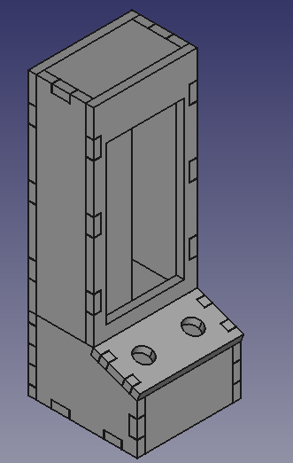

# Arcade Style LED Matrix Enclosure

This enclosure is for an LED matrix (16x2), 2 buttons, and some microcontroller (Arduino Nano for example) designed in the shape of an arcade game.

This is still a work-in-progress, but usable

### TODO:
- Finish up refence dimentions from the spreadsheet
- Lower the tollerance on some of the slots (too tight but usable when tested)
- (maybe?) Create an assembly instructions/diagram
